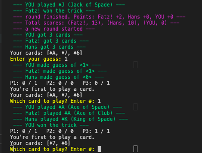

# Eumel
Blazor WebAssembly App for playing cards. The game _Eumel_ has various names and is a little bit like `Wizard` (but without wizards :laughing:). See also [Oh Hell](https://en.wikipedia.org/wiki/Oh_Hell) on wikipedia.

## Why
- :spades: :diamonds: I like the simple game concept and wanted to try playing it remotely with my family (2020 etc)
- Learn / Evaluate Blazor WebAssembly
- Practice applying different designs/architecture styles, like more immutables and event sourcing

## Screenshots
### Playing in the command line:

### "Lobby browser" view with all games:

### Gameplay on mobile:

## Quickstart  :snail:
The quickest way to get started is using a __VS Code devcontainer__ setup.

The devcontainer comes with the dotnet SDK and some preinstalled VS Code extensions (additional containers are started to host a local [PostgreSQL](https://www.postgresql.org) database and [pgAdmin](https://www.pgadmin.org) to inspect it in the browser). 

### Prerequisites
- [Docker Desktop](https://www.docker.com/products/docker-desktop)
- [VS Code](https://code.visualstudio.com/download) with the extension [Remote - Containers](https://marketplace.visualstudio.com/items?itemName=ms-vscode-remote.remote-containers) (`ms-vscode-remote.remote-containers`)

### Get started
- When you open the repo in VS Code, the remote extension will suggest reopening the workspace in a container. Do it :)
- open a new integrated terminal of type `zsh`, run `dotnet run src/Console` to play against two bots.
- to start the whole app, first migrate the local db with `dotnet ef database update --project src/Persistence`. 
Then you can start the server with `ctrl`+`F5` (or `dotnet run src/Server`)

## Overview of the code
### Projects in the repo
- __Eumel.Core__ contains inner logic of the game flow. The whole __game state__ (players, cards, points) is only changed through __events__, the goal was to keep as much of the code here side-effect free as possible. But it also has classes with state that dispatch the events and manage the 'game flow'.
    - the core is (meant to be) _persistence and infrastructure agnostic_. Not by abstracting those details away into interfaces, but really, really agnostic.
- __Eumel.Console__ was the first user interface and is meant as an example/test for reusability of the _Core_ without any workarounds.
- __Eumel.Shared__ defines some DTOs and interfaces for client/server communication but is not depending on any protocol/library.
- __Eumel.Client__ is a blazor WASM app that defines some blazor components, pages using them and a `GameClient` service that uses [SignalR](https://dotnet.microsoft.com/apps/aspnet/signalr) for bidirectional communication with the server.
- __Eumel.Persistence__ knows how to persist games/rooms and game events. Is using EF core (probably not that well :see_no_evil:) to put everything in a PostgreSQL db.
- __Eumel.Server__ defines an ASP api (currently only a game room controller) and the SignalR Hub. Running games are managed and loaded into memory (until the server breaks down :)). Observed Events from games are forwarded to the SignalR clients and also persisted.
### Tests
.. are not so many, have a look yourself. For integration testing, a second db is prepared in the postgres container.

## TODOs
... Are [here](TODO.md)

## References

- Event Sourcing using PostgreSQL: https://medium.com/@tobyhede/event-sourcing-with-postgresql-28c5e8f211a2

- https://dylanbeattie.net/2018/11/20/postgresql-heroku-net-core-and-npgsql.html